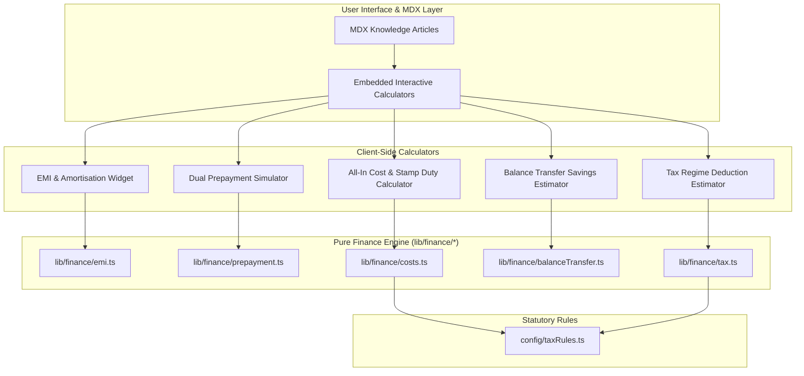

<div align="center">

# 🏦 Home Loan Knowledge Hub & Social Intelligence Dashboard

*A privacy-first Indian home loan financial decision engine & stealth social listening system.*

[](LICENSE)
[](https://python.org)
[](index.html)
[](docs/)
[](CLAUDE.md)

</div>

---

## 📌 Overview

**Home Loan Knowledge Hub** combines a **pure client-side financial computation engine** with an **automated web crawler & social listening dashboard**.

1. **Privacy-First Financial Engine**: Computes exact home loan EMIs, dual-strategy prepayment simulations (EMI vs. Tenure reduction), state-wise stamp duty & MOD charges, balance transfer savings, and Old vs. New Tax Regime deductions entirely in the browser. Zero lead sale, zero data leakage.
2. **Stealth Social Intelligence**: Integrates the `Scrapling` crawler to mine search engines, Reddit, Quora, and MouthShut for customer loan inquiries, complaints, and bank sentiment, mapping them into a 5-way classification matrix and local Excel audit sheet.

---

## 🏛️ System Architecture



> 🎨 **Diagram Triplet**:
> - 📄 [Mermaid Source](diagrams/home-loan-architecture.mmd)
> - 🖼️ [Vector SVG](diagrams/home-loan-architecture.svg)
> - 🖼️ [High-Res PNG](diagrams/home-loan-architecture.png)
> - ✏️ [Editable Excalidraw Scene](diagrams/home-loan-architecture.excalidraw) *(Open directly at [excalidraw.com](https://excalidraw.com))*

---

## 📚 Diataxis Documentation Suite

The repository features comprehensive documentation organized into the four quadrants of the **Diataxis Framework**:

| Quadrant | Title & Link | Description |
|---|---|---|
| 🎓 **Tutorial** | [Simulating Home Loan Prepayment & Amortisation](docs/tutorial-home-loan-prepayment.md) | Step-by-step walkthrough for modeling lump-sum part-payments, recurring prepayments, and comparing tenure vs. EMI reduction. |
| 🛠️ **How-To** | [Calculate All-In Home Loan Processing Costs & Stamp Duty](docs/howto-calculate-all-in-loan-costs.md) | Practical guide for calculating bank processing fees, 18% GST, state stamp duty (1%-7%), and Memorandum of Deposit (MOD) registration fees. |
| 📖 **Reference** | [Financial Calculation API & Schema Manual](docs/reference-finance-api.md) | Full technical specification of `lib/finance/` TypeScript functions, parameters, return types, and statutory constant schemas. |
| 💡 **Explanation** | [Privacy-First Client-Side Financial Architecture](docs/explanation-privacy-first-architecture.md) | In-depth breakdown of zero-lead-sale architecture, browser-local execution model, and data privacy defense against lead aggregators. |

---

## ✨ Features

- 💰 **EMI & Amortisation Schedule**: Monthly principal & interest breakdown with schedule export.
- 📉 **Dual Prepayment Simulator**: Simulates both **Tenure Reduction** (saving maximum interest) and **EMI Reduction** (maximizing monthly cash flow).
- 📜 **State Stamp Duty & MOD Matrix**: Calculates stamp duty across Indian states (Maharashtra, Karnataka, Delhi, Tamil Nadu, Telangana, etc.) and MOD registration caps.
- 🔄 **Balance Transfer Savings Engine**: Calculates net savings after accounting for foreclosure fees, new processing charges, legal fees, and title search costs.
- ⚖️ **Tax Deduction Estimator**: Compares Sec 24(b) (₹2 Lakh interest cap) & Sec 80C (₹1.5 Lakh principal cap) under the Old Tax Regime vs. New Tax Regime.
- 🕵️ **Stealth Forum Crawler**: Scrapes public forum discussions via `Scrapling` without triggering anti-bot blocks.
- 📊 **5-Way Sentiment Classifier**: Categorizes queries into *Displeasure*, *Complaint*, *Query*, *Discussion*, and *Appreciation*.
- 🏢 **Institutional Mentions**: Automatically identifies customer logs mentioning major lenders (HDFC Bank, SBI Home Loans, ICICI Bank, LIC HFL, Axis Bank, etc.).

---

## 📁 Repository Structure

```text
loan_system/
├── docs/                                   # Diataxis Documentation Suite
│   ├── tutorial-home-loan-prepayment.md    # Prepayment tutorial guide
│   ├── howto-calculate-all-in-loan-costs.md # Processing & stamp duty guide
│   ├── reference-finance-api.md            # Technical API reference
│   └── explanation-privacy-first.md        # Privacy architecture explanation
├── diagrams/                               # Architecture Diagram Triplet
│   ├── home-loan-architecture.mmd          # Mermaid source
│   ├── home-loan-architecture.svg          # Vector graphic
│   ├── home-loan-architecture.png          # High-resolution PNG
│   └── home-loan-architecture.excalidraw   # Editable Excalidraw scene
├── lib/
│   └── finance/                            # Pure TypeScript Financial Engine
│       ├── emi.ts                          # EMI & monthly schedule engine
│       ├── prepayment.ts                   # Prepayment simulator
│       ├── costs.ts                        # Processing fee & stamp duty
│       ├── balanceTransfer.ts              # Balance transfer savings engine
│       └── tax.ts                          # Tax regime comparison engine
├── config/
│   └── taxRules.ts                         # Statutory tax caps & state stamp duty rates
├── app.js                                  # Dashboard UI controller
├── index.html                              # Responsive HTML5 interface
├── style.css                               # Custom CSS styling with mobile queries
├── server.py                               # Scrapling crawler backend & REST API
├── test_scanner.py                         # Automated test suite (TTHW < 2 min)
├── PROJECT_CONTEXT.md                      # gstack review report & roadmap
├── CLAUDE.md                               # Agent skill routing instructions
└── README.md                               # Project documentation
```

---

## ⚡ Quick Start

### Prerequisites

- **Python**: 3.10+
- **Browser**: Any modern browser (Chrome, Firefox, Edge, Safari)

### Installation

1. **Clone the repository:**
   ```bash
   git clone https://github.com/mauryarahul007/loan_system.git
   cd loan_system
   ```

2. **Install Python dependencies:**
   ```bash
   pip install openpyxl scrapling curl-cffi browserforge
   ```

3. **Start the local server:**
   ```bash
   python server.py
   ```

4. **Launch Dashboard**: Open **[http://localhost:8000](http://localhost:8000)** in your browser.

---

## 🧪 Verification & Testing

Run the automated self-check test suite:

```bash
python test_scanner.py
```

*Time-to-Hello-World (TTHW): **< 2 minutes**.*

---

## 🛠️ Built with gstack Skill Suite

This project utilizes the `gstack` agent skill suite for automated quality assurance and review:

- `/autoplan` — Full CEO, Design, Eng, and DX review pipeline.
- `/devex-review` — Developer experience audit (Score: 8.4/10).
- `/plan-eng-review` — Architecture, test coverage, and code quality review.
- `/document-generate` — Diataxis documentation suite generation.
- `/document-release` — Post-ship documentation health & coverage audit.
- `/diagram` — Offline Mermaid to Excalidraw / SVG / PNG rendering.

---

## 📄 License

This project is licensed under the [MIT License](LICENSE).
