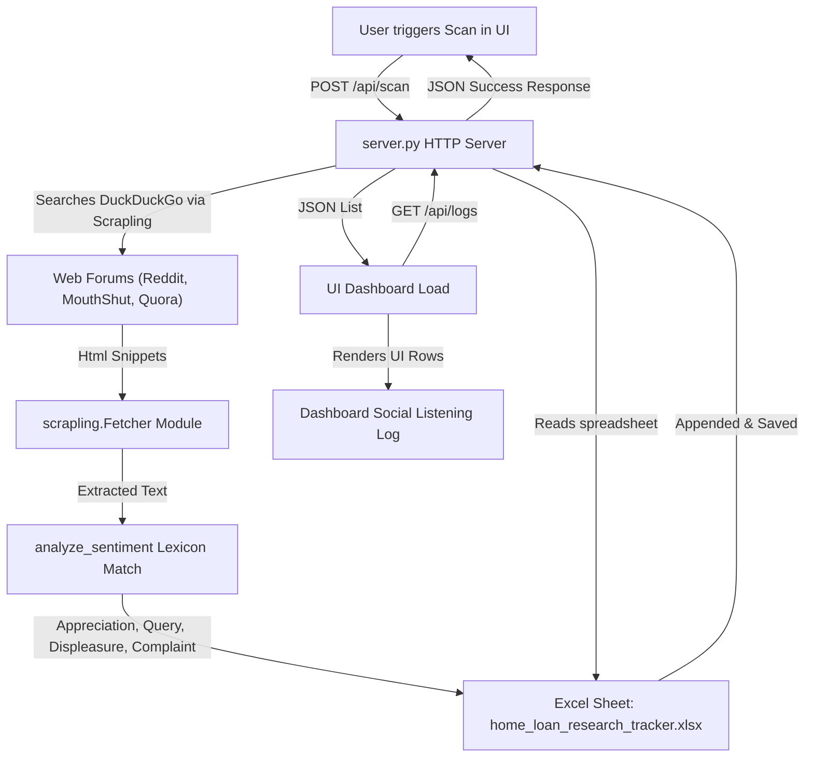
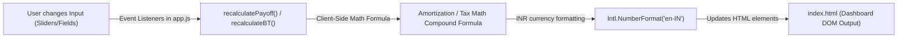

# Home Loan Knowledge Hub - Codebase Overview

Welcome to the detailed codebase documentation for the **Home Loan Research & Social Listening Dashboard**. This project is a client-side first, privacy-preserving application designed to educate borrowers, simulate loan payoffs (using prepayments, balance transfers, and tax planning), and track consumer pain points by scraping competitor reviews and social posts.

---

## 1. Directory Structure Map

Below is a layout of the primary files in this workspace:

*   [server.py](file:///c:/ProjectsV1/Loans%20project/server.py): The Python backend. It hosts an HTTP server on port 8000 with cache-control overrides, executes web scraping searches using `scrapling`, and writes/reads compiled logs to the local Excel sheets.
*   [app.js](file:///c:/ProjectsV1/Loans%20project/app.js): The central JavaScript controller. It manages UI state, triggers backend scans, and hosts 25+ pure JavaScript math engines for loan payoff schedules, tax planning, and affordability checklist logic.
*   [index.html](file:///c:/ProjectsV1/Loans%20project/index.html): The complete frontend user interface. Implements a responsive dark-themed dashboard using a glassmorphic sidebar layout, tab panes, metric cards, and calculator work areas.
*   [style.css](file:///c:/ProjectsV1/Loans%20project/style.css): Vanilla CSS defining custom styles, fonts (Outfit and Inter), variables, dark mode styling, and transition animations.
*   [test_scanner.py](file:///c:/ProjectsV1/Loans%20project/test_scanner.py): Python unit test checking scraper dependencies and assuring that returns match the required data schema.
*   [test_solutions_qa.py](file:///c:/ProjectsV1/Loans%20project/test_solutions_qa.py): Automated testing script verifying that [app.js](file:///c:/ProjectsV1/Loans%20project/app.js) contains the exact DOM elements and binders for all 25 core loan solutions.
*   [PROJECT_CONTEXT.md](file:///c:/ProjectsV1/Loans%20project/PROJECT_CONTEXT.md): Project overview, competitor gap matrices, prioritized feature roadmaps (RICE framework), and local database configuration notes.
*   [CLAUDE.md](file:///c:/ProjectsV1/Loans%20project/CLAUDE.md): Quick commands list, setup checks, and local environment variables mapping.
*   **Excel Database**: Located at `C:\Users\Rahul\Downloads\home_loan_research_tracker.xlsx`. Holds the primary ledger of scraped customer experiences, classified by platform, source, pain tags, and severity.

---

## 2. Interactive Data Flow

The project is split into two primary pipelines: **Social Listening Data Sourcing** and **Client-Side Financial Modeling**.

### A. Social Listening Data Pipeline
Mentions and pain points flow from the web to the local spreadsheet, and are then served to the frontend dashboard:

### B. Client-Side Financial Modeling Pipeline
Calculators execute 100% locally on the user's browser, preventing PII leaks or aggregator spam:

---

## 3. Core Technologies & Dependencies

1.  **Python 3.10+ Backend**:
    *   `http.server.HTTPServer` for hosting local pages.
    *   `openpyxl` for loaded spreadsheet modification.
    *   `scrapling` (Tier 1 scraper utilizing `curl_cffi` and `browserforge` under the hood) for high-performance requests.
2.  **Modern JavaScript Frontend**:
    *   100% framework-free vanilla JavaScript code for state binding.
    *   Standard browser HTTP request handlers utilizing `fetch` asynchronous APIs.
3.  **Styling**:
    *   Vanilla CSS variables for colors, spacing, and font sizes.
    *   Glassmorphism layouts (`backdrop-filter` rules).
    *   Flexbox and CSS Grid layout structures.
